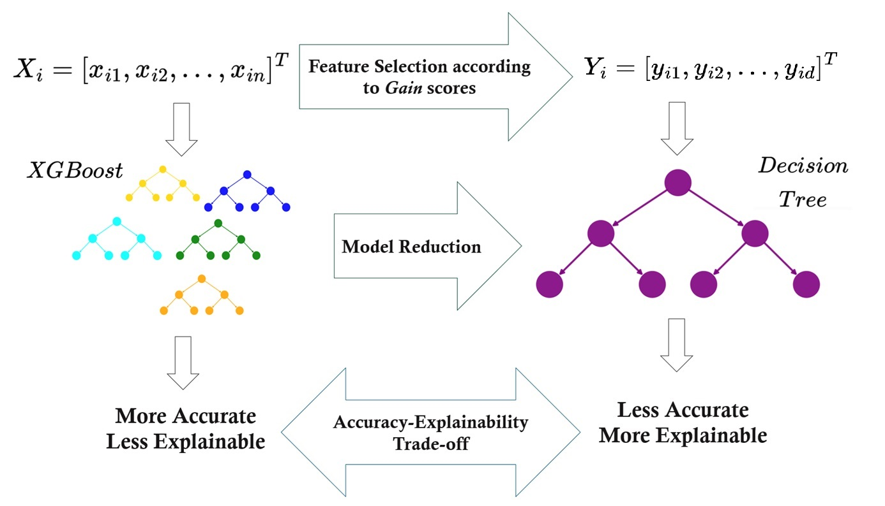

# GainXplaine (A Novel Explainable Approach for Intrusion Detection)



**Author:** Ehsan Namjoo  
**Affiliation:** Biocomputing and Development Systems, Computer Science and Information System Faculty, University of Limerick.   
**Date:** March 23, 2025.


## Repository Overview

This repository contains the code, data, and results associated with the paper "A Novel Explainable Approach for Intrusion Detection." It is structured to allow readers to replicate the analyses presented in the paper, explore the methodology in more detail, and use the code for their own research.

## Paper Abstract
Intrusion Detection Systems (IDSs) are vital defense mechanisms against cyberattacks in data networks. Given the growing frequency and diversity of cyberattacks, designing effective IDSs to protect information systems has become increasingly critical. In addition to achieving acceptable accuracy, the explainability of an IDS is essential for fostering trust and accountability. This paper introduces an explainable anomaly detection system for identifying malicious attacks.

To achieve this, we first train an XGBoost model on a dataset containing traffic features from both malicious and normal activities. Next, we compute Gain scores, which measure the average improvement in the model's loss function due to each feature during splits in the boosting trees. Based on these Gain scores, we extract a subset of significant features. A decision tree is then trained using the most important features—those with the highest Gain scores—where the number of features, denoted as d, is much smaller than the total number of available features.

This approach enables the development of an explainable model that does not sacrifice performance. By reducing the number of features involved, we generate a shallow, inherently explainable, and accurate decision tree. Performance metrics, including accuracy, precision, and recall, demonstrate the effectiveness of the proposed method.


## Files and Directories

- **code/**: Contains all the scripts and notebooks used for data analysis and modeling.
    - `script1.py`: [Brief description of the script].
    - `script2.py`: [Brief description of the script].
- **data/**: Raw and processed data files used in the paper.
    - `raw_data.csv`: [Brief description of the dataset].
    - `processed_data.csv`: [Brief description of the processed dataset].
- **results/**: Results of the analysis (e.g., plots, tables, figures).
    - `figure1.png`: [Brief description of the figure].
    - `table1.csv`: [Brief description of the table].
- **LICENSE**: License information for the repository (if applicable).
- **requirements.txt**: List of Python dependencies for the project.
- **README.md**: This file, which provides an overview of the repository.

## Dataset (**CIC-IDS 2017**)

The **CIC-IDS 2017** dataset is a widely used benchmark dataset for **Intrusion Detection Systems (IDSs)**. It was created by the Canadian Institute for Cybersecurity (CIC) and contains realistic network traffic data, including both normal and malicious activities. The dataset is designed to help researchers and practitioners develop, evaluate, and benchmark intrusion detection models.

### **Dataset Overview**
- **Source**: [Canadian Institute for Cybersecurity (CIC)](https://www.unb.ca/cic/datasets/ids-2017.html)
- **Purpose**: Used for **anomaly detection** and **cybersecurity research**.
- **Traffic Types**: Includes both **benign** and **malicious** traffic.


### **Features**
- Network flow-based features extracted using **Bro-IDS** and other analysis tools.
- Includes **80+ attributes**, such as packet size, flow duration, source/destination IPs, and protocol types.
- Captures network behavior over a **five-day period**.

### **Download & Usage**
The dataset can be accessed from the official **[CIC-IDS 2017 website](https://www.unb.ca/cic/datasets/ids-2017.html)**. It is available in various formats, including **CSV and PCAP**, for different analysis purposes.

### **Citing the Dataset**
If you use this dataset in your research, please cite it as per the guidelines provided by the [Canadian Institute for Cybersecurity](https://www.unb.ca/cic/datasets/ids-2017.html).


## How to Use the Code

1. Clone the repository:
    ```bash
    git clone https://github.com/username/repository-name.git
    ```

2. Install the necessary dependencies:
    ```bash
    pip install -r requirements.txt
    ```

3. Run the code:
    - The main analysis script is `script1.py`. To run it, use the following command:
    ```bash
    python script1.py
    ```

4. (Optional) If you're using Jupyter Notebooks, you can open the notebooks in JupyterLab or Jupyter Notebook:
    ```bash
    jupyter notebook
    ```

## Data Description

Provide a detailed description of the datasets used in the paper. If the data is publicly available, include citations to the original source(s). If the data is proprietary, specify any access conditions.

- **Data source**: [Where did the data come from?]
- **Size**: [Number of records, or file size]
- **Format**: [CSV, Excel, etc.]
- **Description**: [Any specifics on the data collection, preprocessing steps, or features of interest.]

## Dependencies

List the dependencies required to run the code, for example:
- Python 3.x
- Pandas
- NumPy
- Matplotlib
- scikit-learn

To install the dependencies, use the `requirements.txt` or install them manually:
```bash
pip install pandas numpy matplotlib scikit-learn
